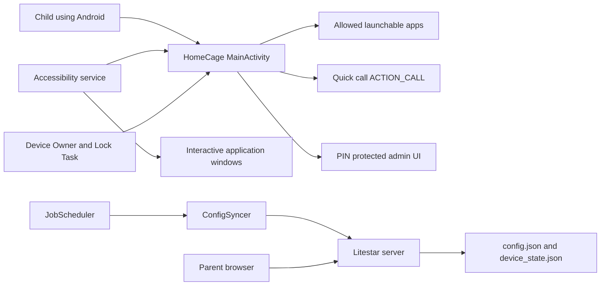

# HomeCage: Full Investigation

Audit date: 2026-06-19
Branch: `fix/accessibility-fail-open`
Commit: `55fad5ebe93ab00912e5b4df3cafe8dfdf1315e6`
Comparison branch: `dev/remote_control` at `78b1c99`
Scope: 68 tracked files plus the local untracked `sec.txt`

## Executive Verdict

The specific Accessibility fail-open that allowed an event from an approved auxiliary package to remove the block over a forbidden browser is materially fixed in this branch.

The fix now keeps the previous blocked state, retrieves interactive Accessibility windows, checks the focused or active application window, and only clears the block when that real application window belongs to HomeCage or a launchable allowed app. Manual compatibility packages are also excluded from launcher cards and the Device Owner Lock Task allowlist.

However, this branch is not ready to replace `dev/remote_control`.

The most important reason is Git lineage: this branch contains one unique fix commit but is missing fifteen commits from `dev/remote_control`. Releasing or merging it as a replacement would remove:

- multi-device server support;
- HACS/Home Assistant integration;
- location requests and reports;
- lost/stolen-phone mode;
- Linux service installer and OpenRC fixes;
- location-request feedback;
- first-contact server bootstrap that protects a phone's local allowlist;
- newer README content and decoration.

The safe integration direction is therefore: apply or rebase commit `55fad5e` onto the current `dev/remote_control`, resolve the seven overlapping Android files, and test the combined result. Do not merge this branch by replacing the newer branch wholesale.

## Headline Findings

| Priority | Finding | Result |
|---|---|---|
| P0 | Branch is 15 commits behind `dev/remote_control` | Release blocker. It removes requested safety and management features. |
| P0 | `sec.txt` is untracked and not ignored | Publication blocker. It contains a credential-shaped value and a deployment URL. Values are intentionally omitted here. |
| P0 | Server authentication is optional by default | Empty `HOMECAGE_ADMIN_TOKEN` makes every route anonymous while the server binds to `0.0.0.0`. |
| P0 | Example server token is public and usable | Quick-start copies `change-this-token` without requiring replacement. |
| P1 | Fresh server still wipes the phone allowlist | The phone reports its local policy, then downloads the server's empty default and applies it. |
| P1 | Public default app PIN is `1234` | No forced rotation exists. Every README and locale exposes the value. |
| P1 | Launcher always says `Safe mode: ARMED` | The label is independent of Device Owner, Accessibility, Lock Task, and policy-call success. |
| P1 | Manual/system/phone trust is still package-wide | The exact transient-event bug is fixed, but broad trusted packages may still host unintended UI. |
| P1 | Server is still single-device | `deviceId` is stored but ignored for config/state selection. Two phones overwrite/share state. |
| P2 | Global admin grace disables Accessibility for all apps | Five minutes of unrestricted package behavior after admin authentication. |
| P2 | Admin screen does not expire | The screen remains privileged after the nominal session timestamp expires. |
| P2 | PIN attempts are unlimited | PBKDF2 slows each guess but there is no persistent cooldown or lockout. |
| P2 | Browser admin has no CSRF protection | A cached Basic-auth browser can be targeted by a cross-site form submission. |
| P2 | UI and JobScheduler sync can overlap | The new revision check protects local edits, not two concurrent remote responses. |
| P2 | Device Admin requests unused `force-lock` | The code never calls `lockNow`; the capability is unnecessary and the uninstall copy overpromises. |
| P2 | CI does not test release or security behavior | It only builds debug and compiles Python syntax. |

## What The Project Actually Contains

At this commit the repository contains two runtime products:

1. A Kotlin Android launcher/kiosk application in `app/`.
2. A Litestar configuration server in `server/`.

It does not contain the HACS integration, Linux service installer, location implementation, lost mode, or the newer multi-device server. Those exist on `dev/remote_control`, not here.

## Android Architecture

### Startup And Launcher

`MainActivity.onCreate()` initializes preferences, package discovery, Device Owner policy, periodic sync, the launcher screen, and an opportunistic remote sync.

`onResume()` repeats app discovery and policy application, attempts Lock Task, and checks whether another sync is due. This gives the launcher repeated opportunities to restore policy after returning from another activity.

The main screen is a custom View hierarchy, not Compose. It shows:

- the HomeCage title;
- a hardcoded green `Safe mode: ARMED` subtitle;
- an Admin button;
- quick-call contacts;
- launchable apps whose package is in the local allowed set.

The UI does not derive `ARMED` from actual enforcement state. A phone with neither Device Owner nor Accessibility enabled displays exactly the same green status as a fully pinned Device Owner phone.

### PIN And Admin Boundary

The admin dialog accepts 4 to 12 digits and verifies the PIN on a background thread. The positive button starts disabled, so the earlier empty-PIN `Open` bug is not present.

PIN storage is better than plaintext:

- 16-byte random salt;
- PBKDF2-HMAC-SHA256;
- 80,000 iterations;
- 256-bit output;
- constant-time comparison of encoded hash strings;
- app backup disabled in the manifest.

The weaknesses are policy-level:

- every fresh install gets `1234`;
- rotation is only recommended, not required;
- no failed-attempt counter exists;
- no persistent delay or lockout exists;
- the authenticated Admin screen itself never expires;
- the five-minute timestamp globally disables Accessibility enforcement.

Opening Device Admin, Accessibility, restricted app settings, or the call permission screen refreshes the same global admin grace. This is convenient for setup but broader than needed. It should be scoped to the exact parent workflow and revoked on task/background transitions.

### Device Owner And Lock Task

`KioskPolicyManager` performs these operations when HomeCage is Device Owner:

- installs HomeCage as persistent HOME;
- configures Lock Task packages;
- disables Lock Task features;
- disables the status bar;
- disables the keyguard;
- starts Lock Task when permitted.

The removal path stops Lock Task, reenables status/keyguard, clears persistent HOME, removes active admin where possible, and clears Device Owner.

Every important policy call is wrapped in `runCatching`, but failures are discarded. The application therefore cannot distinguish:

- fully applied policy;
- stale Lock Task package grants;
- failed persistent HOME;
- failed status bar or keyguard restriction;
- Lock Task that never started.

This is the root reason the visible `ARMED` state is not trustworthy.

### Accessibility Enforcement

The service subscribes to `TYPE_WINDOW_STATE_CHANGED` and `TYPE_WINDOWS_CHANGED` and now requests:

- `flagRetrieveInteractiveWindows`;
- `canRetrieveWindowContent=true`;
- `flagReportViewIds`;
- no gesture capability.

The code only reads the root package name. `flagReportViewIds` is not used and can be removed. The README and consent copy should clearly explain that the service technically gains interactive-window-content access even though the implementation only uses package identity.

Current decision flow:

1. Read `event.packageName`.
2. If global admin grace is active, clear the block and return.
3. If the event belongs to HomeCage, clear the block and return.
4. If the event package is allowed, keep an existing block unless the focused/active application window is verified as HomeCage or a launchable allowed app.
5. If the event package is forbidden, show a full-screen Accessibility overlay, start HomeCage, and schedule a watchdog.
6. The watchdog retries every 500 ms, at most five times.

#### What The Fix Closes

Previously, any event from a trusted system, keyboard, phone, or manual package immediately removed the overlay and erased `lastBlockedPackage`. A forbidden browser could remain underneath and become usable.

Now an allowed auxiliary event cannot clear an existing block merely because its own package is trusted. The service verifies an application window and explicitly refuses blocked packages and non-launchable manual packages.

This directly addresses the observed Mi Browser plus SystemUI/IME event-confusion path.

#### What Still Needs A Real MIUI Test

- HomeCage's own event clears the block without calling the same active-window verifier.
- The watchdog stops after five attempts.
- `returnHome()` and overlay operations swallow failures.
- OEM window ordering can differ when IME, calls, permission dialogs, custom tabs, picture-in-picture, or vendor plugins are present.
- Manual packages are still fully allowed when they are themselves the foreground package and there was no previous blocked state.
- Hardcoded phone and system packages remain whole-package trust domains.

The correct regression test must record event package, event type, all application windows, focused/active state, root package, overlay state, and current Lock Task state. A screenshot alone cannot prove the state machine.

### Package Policy

There are four effective package roles, but only three are explicitly modeled:

1. Blocked system packages: Settings, installers, security center, and common launchers.
2. Allowed system packages: Android, SystemUI, permission controllers, MIUI permission UI, and Google Play Services.
3. Phone packages: dialer, in-call UI, telecom, contacts, and vendor variants.
4. Parent-selected packages: launchable apps plus manual package names.

The fix introduces local role separation for manual packages:

- manual packages are not shown as launchable cards;
- manual packages are removed from Device Owner Lock Task packages;
- manual packages are not accepted by `verifyForegroundAllowed()`.

But `isAllowedPackage()` still accepts every manual package. That is necessary for some transient compatibility events, yet it also means a user-facing activity hosted by the same package is treated as trusted. A proper model should represent capabilities such as `transient_window_source`, `launchable_app`, `phone_ui`, and `system_infrastructure`, not one package-wide boolean.

### Quick Calls

The parent stores contacts manually as `Name | Phone`. HomeCage does not read Android contacts.

Calling requires:

- `CALL_PHONE` runtime permission;
- a user confirmation dialog;
- `ACTION_CALL` with a URI-encoded number.

This path is appropriately narrow. The remaining risk is not URI injection but the broad package trust granted to dialer/contact packages after the call begins.

### Local Persistence

`KioskPreferences` stores these values in app-private SharedPreferences:

- allowed and manual package sets;
- policy revision;
- locale;
- quick-call contacts;
- server URL and bearer token;
- sync timestamps/status;
- admin-session expiry;
- PIN salt/hash/default marker.

The server token is not encrypted with Android Keystore. App sandboxing and `allowBackup=false` provide basic protection, but a rooted/debuggable/compromised device can recover it. Release is explicitly non-debuggable.

### Remote Sync

There are two sync triggers:

- a persisted 15-minute JobScheduler job requiring network;
- foreground `onCreate()`/`onResume()` checks, also throttled by the last attempt for 15 minutes.

This does not implement the earlier requirement of every 10 minutes or every launcher unlock. Opening the launcher only synchronizes when the 15-minute throttle has expired. The Sync Now button bypasses the throttle.

Sync order:

1. Mark attempt time.
2. Skip a non-forced sync while admin grace is active.
3. Snapshot local policy revision.
4. Discover launchable apps.
5. POST device state and local allowlist.
6. GET server config.
7. Abort apply if local admin policy changed during the request.
8. Classify remote non-launchable packages as manual.
9. Replace local policy and optional PIN.
10. Apply Device Owner policy and record sync success.

The new revision check is useful, but incomplete:

- `syncInFlight` exists only inside MainActivity;
- JobScheduler can run a second `ConfigSyncer` concurrently;
- two remote workers can share the same local revision;
- there is no server config revision or compare-and-set;
- policy application failures still count as sync success.

Most importantly, this branch lacks the later bootstrap fix. On a fresh server, `/api/config` returns an empty list. The phone first reports its local list, but the server stores it only as device state. The phone then fetches the independent empty config and erases its local allowlist.

## Server Architecture

### Runtime And Storage

The server is one Litestar application with four routes:

| Route | Purpose |
|---|---|
| `GET /` | Render browser admin. |
| `POST /admin/config` | Replace allowlist and optional remote PIN. |
| `GET /api/config` | Return allowlist and remote PIN to the phone. |
| `POST /api/device-state` | Store phone ID, installed apps, and local allowlist. |

Storage is two global JSON files:

- `config.json`;
- `device_state.json`.

Writes use a `.tmp` file followed by replace, which avoids partially written JSON in the normal single-process case. There is no lock for concurrent writers and no database transaction/version.

### Authentication

The same `HOMECAGE_ADMIN_TOKEN` authorizes:

- Bearer API requests;
- browser Basic Auth, with any username and the token as password.

If the token is empty, `is_authorized()` returns true. The default bind address is `0.0.0.0`. This combination makes a forgotten environment variable a complete anonymous control-plane exposure.

The example `.env` uses `change-this-token`, and the quick-start says to copy and source it but does not force replacement. This is a reachable known default credential.

Token comparison uses normal string equality, not a constant-time comparison. That is secondary to the default/empty-token problems.

### Browser Security

Dynamic labels, package names, timestamps, and messages are HTML-escaped. A TestClient injection with a script-shaped application label rendered escaped, so no direct stored XSS was found.

The form mutation has no CSRF token and no Origin/Referer validation. Because the browser interface uses cached HTTP Basic credentials, a malicious page can attempt a cross-site form POST to the local server. The mutation can replace allowed packages and set a PIN.

### Device Model

The phone reports `deviceId`, but the server does not use it as a key. Every phone:

- writes the same `device_state.json`;
- reads the same `config.json`;
- receives the same PIN and allowlist.

This is not multi-device support. Adding a second child phone causes normal cross-device policy collision even without an attacker.

### Data Validation

Positive controls:

- package strings are trimmed, deduplicated, and sorted;
- PIN must be 4 to 12 digits;
- rendered data is escaped;
- JSON writes use replace.

Gaps:

- no request-size limits in project code;
- JSON shape validation is minimal;
- no per-device authorization;
- no CSRF protection;
- no rate limiting;
- remote PIN is stored in plaintext JSON and repeatedly returned until cleared;
- no audit trail;
- no config revision or optimistic concurrency control.

No SQL, shell execution, `eval`, unsafe deserialization, attacker-selected filesystem path, or server-side URL fetch exists in this branch.

## Missing Intended Components

The following components are absent from this branch but present on `dev/remote_control`:

| Component | Consequence of absence |
|---|---|
| `homeassistant/` HACS custom repository | Home Assistant cannot install or manage HomeCage. |
| Per-device server storage and selector | Multiple phones share and overwrite one policy/state. |
| `DeviceLocationProvider.kt` | Server cannot request or display phone location. |
| Lost mode | Server cannot remotely lock down a lost/stolen phone. |
| `server/install-service.sh` | No automatic systemd/OpenRC installation or port selection. |
| Server bootstrap | Fresh server erases the phone allowlist. |
| Newer server UI/device naming | Parent cannot select a child/device. |

There are no stale HACS/location/lost-mode/installer claims in the current branch README because those sections are also absent. That is internal consistency, but it confirms the branch is an older product, not the intended fixed successor.

## Permissions And Privileged Capabilities

| Capability | Used | Assessment |
|---|---|---|
| `INTERNET` | Server sync | Necessary. |
| `ACCESS_NETWORK_STATE` | JobScheduler network constraint | Necessary; its earlier absence caused the observed crash. |
| `RECEIVE_BOOT_COMPLETED` | Reschedule persisted sync | Reasonable. |
| `CALL_PHONE` | Confirmed quick calls | Sensitive but feature-required. |
| Launcher package query | Enumerate launchable apps | Narrower than `QUERY_ALL_PACKAGES`. |
| Device Owner | Persistent HOME, Lock Task, status/keyguard | Strongest supported kiosk path. |
| Legacy Device Admin | Activation/removal fallback | Overclaimed; only unused `force-lock` is declared. |
| Accessibility | Window identity and blocking overlay | Sensitive and necessary for fallback, but docs must disclose interactive-window access. |

Not requested in this branch:

- Usage Access;
- draw over other apps;
- contacts;
- SMS;
- location;
- camera;
- microphone;
- notification listener;
- VPN;
- `QUERY_ALL_PACKAGES`.

`device_admin.xml` declares `<force-lock />`, but there is no `lockNow()` call. Remove the policy unless a real feature uses it. Device Admin by itself also does not prove that HomeCage PIN mediates deactivation; the current explanation is stronger than the implementation.

## Documentation, Localization, And Resources

### Android Strings

All five catalogs contain exactly 106 string keys:

- English;
- Russian;
- Spanish;
- Simplified Chinese;
- Japanese.

There are no duplicate keys, missing keys, extra keys, or format-placeholder mismatches.

Security-copy problems exist in every locale because they originate from the common design:

- the launcher always says protection is armed;
- Accessibility says the child cannot leave parental mode;
- Device Admin copy says the child cannot remove the app without the PIN.

These are guarantees the runtime cannot always prove.

### README Files

The English README is the only one with a full remote-server section. Russian, Spanish, Japanese, and Chinese READMEs stop after removal instructions. They explain permissions and restricted settings but are not complete translations of the primary document.

The README correctly states that:

- release should be signed and non-debuggable;
- cleartext is debug-only;
- Device Owner is preferred;
- server policy overwrites local policy;
- no location/Usage Access/overlay/contact permission is used in this branch.

It does not explain that the new Accessibility fix sets `canRetrieveWindowContent=true` and retrieves interactive windows. It also describes fallback blocking more absolutely than the implementation supports.

The decorated README from the newer main/dev history is not present in this branch.

### Icons

Resource wiring is correct:

- manifest uses `@mipmap/ic_launcher` and `@mipmap/ic_launcher_round`;
- adaptive icons use the dark vector background and density-specific foreground WebP;
- the Play Store image is 512x512 RGB PNG;
- standard and round raster icons have expected 48/72/96/144/192 pixel density sizes;
- foreground images have expected 108/162/216/324/432 pixel sizes.

The round and standard legacy bitmap at each density are byte-identical, which is acceptable if the artwork already contains safe padding. The adaptive `monochrome` resource points to the colored foreground instead of a dedicated single-color mask, so themed-icon appearance should be visually checked.

Root source artwork is intentionally ignored; generated launcher resources are tracked.

## Build, Release, And CI

Android configuration:

- application ID `com.homecage.kiosk`;
- version code `1`;
- version `0.1.0`;
- minimum API 26;
- target/compile API 35;
- Java toolchain 17;
- release `isDebuggable=false`;
- release minification disabled;
- release task refuses to run without `keystore.properties`.

Release manifest does not opt into cleartext. Debug manifest explicitly enables cleartext for local testing.

The Gradle distribution URL has a SHA-256 pin and URL validation. The committed wrapper JAR was inspected as an archive, but its provenance was not independently compared to an official online checksum in this offline audit.

CI currently performs only:

- `./gradlew assembleDebug`;
- `python -m compileall server/app`.

Missing CI gates:

- release assembly;
- release merged-manifest assertions;
- Android lint;
- unit tests;
- instrumentation tests;
- Accessibility state-machine regression tests;
- server endpoint/auth/bootstrap tests;
- Python dependency installation and tests;
- secret scanning;
- dependency lock/advisory scanning;
- APK signature/debuggable verification.

The server dependency is a range, `litestar[standard]>=2.13,<3.0`, with no lock file. Builds are therefore not fully reproducible.

## Credential And Publication Audit

No private key, release keystore, real tracked server token, APK, AAB, or server data was found in tracked source.

Ignore rules cover common secrets and generated outputs, but do not cover `sec.txt`.

`sec.txt` is currently untracked and contains:

- a long credential-shaped hexadecimal value;
- a private deployment URL.

The values are not reproduced in this report. Treat the credential as compromised if it has ever been sent, staged, archived, or shown publicly. Rotate it, move operational secrets outside the repository, and add an ignore rule or a safe secret-management convention.

The placeholder `change-this-token` is tracked by design, but it must never be accepted as a production token.

## Verification Performed

Passed:

- full 69-row file/worklist coverage;
- Python `compileall`;
- installed Python dependency consistency via `pip check`;
- Litestar authentication and form/API TestClient paths;
- anonymous behavior with an empty token;
- server HTML escaping with a script-shaped app label;
- fresh-server empty config behavior;
- XML well-formedness for manifests/resources;
- equality of all Android locale key sets;
- equality of all localized format placeholders;
- POSIX and Bash syntax for the Gradle wrapper;
- Git whitespace check;
- resource dimensions, hashes, and adaptive-icon wiring;
- Gradle distribution hash presence;
- Git branch ancestry and full tree comparison.

Blocked by environment:

- `assembleDebug` and `assembleRelease` could not run because this sandbox prohibits the Gradle single-use daemon from binding its local TCP socket: `java.net.SocketException: Operation not permitted`.
- No physical MIUI phone was available for Accessibility event/window recording.
- No browser-specific cross-origin Basic-auth CSRF harness was run.

The Gradle failure is an execution-environment restriction, not a compiler error discovered in the project.

## Recommended Integration Plan

1. Create a new integration branch from `dev/remote_control` at `78b1c99` or newer.
2. Cherry-pick `55fad5e` without taking the old branch versions of unrelated files wholesale.
3. Resolve these seven files deliberately:
   - `MainActivity.kt`;
   - `KioskPolicyManager.kt`;
   - `KioskPreferences.kt`;
   - `KioskAccessibilityService.kt`;
   - `KioskPackagePolicy.kt`;
   - `ConfigSyncer.kt`;
   - `kiosk_accessibility_service.xml`.
4. Preserve the newer multi-device, HACS, location, lost-mode, installer, bootstrap, and documentation changes.
5. Replace static `ARMED` with measured policy health.
6. Separate package roles instead of sharing one boolean allowlist.
7. Require PIN creation/rotation and add persistent attempt throttling.
8. Make server startup fail for empty or known-placeholder tokens.
9. Add CSRF protection and retain per-device state.
10. Run the MIUI event matrix and both release/debug builds before merging.

## MIUI Accessibility Regression Matrix

At minimum, test these transitions while logging events and windows:

| Start | Trigger | Expected result |
|---|---|---|
| HomeCage | Launch forbidden Mi Browser | Overlay appears and HomeCage returns. |
| Forbidden browser | Open/close Gboard | Gboard events do not clear the block. |
| Forbidden browser | Pull SystemUI shade | SystemUI event does not expose the browser. |
| Forbidden browser | Toggle flashlight/power UI | Required system UI works without clearing browser block. |
| Forbidden browser | Event from `com.google.android.ext.services` | Block remains. |
| Forbidden browser | Event from `miui.system.plugin` | Block remains. |
| Forbidden browser | Incoming phone call | Call UI remains usable and browser does not reappear afterward. |
| Allowed app | Open an HTTP link/custom tab | Browser/custom-tab identity is blocked unless explicitly allowed. |
| Allowed app | Open chooser/share sheet | No route to launcher, settings, installer, or browser. |
| Admin | Open Accessibility settings and return | Grace is revoked when launcher resumes. |
| Admin | Leave screen idle past timeout | Privileged controls require PIN again. |
| Service killed/restarted | Reopen forbidden package | Enforcement recovers or launcher reports unprotected state. |

## File-By-File Coverage

Every item below has a completion receipt in the scan artifact ledger.

### Repository And Release Files

| File | Review result |
|---|---|
| `.github/workflows/ci.yml` | Debug/Python syntax only; release assurance gaps reported. |
| `.gitignore` | Common secrets ignored; `sec.txt` gap reported. |
| `LICENSE` | Standard GPLv3 text. |
| `README.md` | Read in full and reconciled with runtime. |
| `README_ru.md` | Read in full; server-section drift noted. |
| `README_es.md` | Read in full; server-section drift noted. |
| `README_ja.md` | Read in full; server-section drift noted. |
| `README_zh-CN.md` | Read in full; server-section drift noted. |
| `build.gradle.kts` | Android/Kotlin plugin versions fixed. |
| `settings.gradle.kts` | Standard repositories and one app module. |
| `gradle.properties` | Standard JVM/Android settings. |
| `gradle/wrapper/gradle-wrapper.properties` | Distribution URL validation and SHA-256 present. |
| `gradle/wrapper/gradle-wrapper.jar` | Archive metadata inspected; online provenance not independently verified. |
| `gradlew` | Standard generated POSIX wrapper; syntax passed. |
| `gradlew.bat` | Standard generated Windows wrapper. |
| `keystore.properties.example` | Placeholder-only values. |
| `sec.txt` | Untracked sensitive publication risk; untouched. |

### Android Code And Manifests

| File | Responsibility / result |
|---|---|
| `app/build.gradle.kts` | API levels, release signing, non-debuggable release. |
| `app/src/debug/AndroidManifest.xml` | Debug-only cleartext traffic. |
| `app/src/main/AndroidManifest.xml` | Permissions, exported components, HOME, admin, job, Accessibility, boot. |
| `KioskApplication.kt` | Locale-wrapped application context. |
| `MainActivity.kt` | Launcher, PIN/admin, calls, policy UI, sync, all custom Views. Findings reported. |
| `KioskDeviceAdminReceiver.kt` | Empty legacy admin receiver. |
| `KioskPolicyManager.kt` | Device Owner/Lock Task/persistent HOME/removal. Failure reporting gap. |
| `AppRepository.kt` | Enumerates launcher activities without `QUERY_ALL_PACKAGES`. |
| `KioskPreferences.kt` | Local policy, PIN verifier, sessions, sync metadata. Findings reported. |
| `QuickCallContact.kt` | Two-field local contact model. |
| `AppLocaleManager.kt` | System/en/ru/es/zh-CN/ja locale switching. |
| `KioskAccessibilityService.kt` | Foreground enforcement and overlay. Fix confirmed, residuals reported. |
| `KioskPackagePolicy.kt` | Blocked/system/phone trust sets and Lock Task packages. |
| `BootReceiver.kt` | Reschedules sync only for protected boot action. |
| `ConfigSyncJobService.kt` | Background worker; can overlap foreground sync. |
| `ConfigSyncResult.kt` | Sync result model. |
| `ConfigSyncScheduler.kt` | Persisted 15-minute network job. |
| `ConfigSyncer.kt` | State report, config fetch/apply, revision guard. Bootstrap/race gaps. |
| `RemoteConfigClient.kt` | HttpURLConnection JSON API, bearer token, HTTPS default. |
| `HomeCageColors.kt` | Static UI palette only. |

### Android XML And Localization

| File | Review result |
|---|---|
| `values/strings.xml` | 106 keys; security-copy issues reported. |
| `values-ru/strings.xml` | Key/placeholder parity passed. |
| `values-es/strings.xml` | Key/placeholder parity passed. |
| `values-ja/strings.xml` | Key/placeholder parity passed. |
| `values-zh-rCN/strings.xml` | Key/placeholder parity passed. |
| `values/styles.xml` | Light no-action-bar theme; main launcher applies its own dark colors. |
| `xml/device_admin.xml` | Unused `force-lock` policy reported. |
| `xml/kiosk_accessibility_service.xml` | Interactive windows enabled; disclosure and testing required. |
| `drawable/ic_launcher_background.xml` | Dark 108dp vector background. |
| `mipmap-anydpi-v26/ic_launcher.xml` | Adaptive icon wiring valid. |
| `mipmap-anydpi-v26/ic_launcher_round.xml` | Round adaptive icon wiring valid. |

### Binary Assets

| File group | Review result |
|---|---|
| `app/src/main/ic_launcher-playstore.png` | 512x512 RGB PNG; metadata/hash recorded. |
| `mipmap-mdpi/ic_launcher.webp` | 48x48 legacy icon. |
| `mipmap-mdpi/ic_launcher_round.webp` | 48x48; identical to standard legacy icon. |
| `mipmap-mdpi/ic_launcher_foreground.webp` | 108x108 adaptive foreground. |
| `mipmap-hdpi/ic_launcher.webp` | 72x72 legacy icon. |
| `mipmap-hdpi/ic_launcher_round.webp` | 72x72; identical to standard legacy icon. |
| `mipmap-hdpi/ic_launcher_foreground.webp` | 162x162 adaptive foreground. |
| `mipmap-xhdpi/ic_launcher.webp` | 96x96 legacy icon. |
| `mipmap-xhdpi/ic_launcher_round.webp` | 96x96; identical to standard legacy icon. |
| `mipmap-xhdpi/ic_launcher_foreground.webp` | 216x216 adaptive foreground. |
| `mipmap-xxhdpi/ic_launcher.webp` | 144x144 legacy icon. |
| `mipmap-xxhdpi/ic_launcher_round.webp` | 144x144; identical to standard legacy icon. |
| `mipmap-xxhdpi/ic_launcher_foreground.webp` | 324x324 adaptive foreground. |
| `mipmap-xxxhdpi/ic_launcher.webp` | 192x192 legacy icon. |
| `mipmap-xxxhdpi/ic_launcher_round.webp` | 192x192; identical to standard legacy icon. |
| `mipmap-xxxhdpi/ic_launcher_foreground.webp` | 432x432 adaptive foreground. |

### Server Files

| File | Responsibility / result |
|---|---|
| `server/.env.example` | Public placeholder token and all-interface bind; unsafe quick-start default. |
| `server/README.md` | Manual venv run, language URLs, token/API documentation. |
| `server/app/__init__.py` | Package marker only. |
| `server/app/main.py` | Entire server, UI, auth, storage, routes. Multiple findings reported. |
| `server/pyproject.toml` | Litestar range, console entry point, no lock/test config. |

## Final Assessment

The Accessibility patch is directionally good and closes the exact event-driven overlay removal that best explains the observed browser escape. It should be preserved.

The branch around it is the wrong release base. The immediate engineering task is integration, not direct merge: transplant the fix into the newer remote-control branch, retain the newer server/HACS/location/lost-mode work, then run the MIUI matrix and release pipeline.

Until that integration and testing are complete, the launcher should not present `Safe mode: ARMED` as an unconditional fact.

## 2026-06-27 Uninstall Incident Addendum

### What Was Reported

The child removed HomeCage from a MIUI phone without disclosing the route. No live ADB trace was available during the incident, so the exact tap path cannot be proven from telemetry. The codebase does, however, expose several plausible removal paths.

### Most Likely Removal Path

The strongest hypothesis is a MIUI app-info / permissions / device-admin route reached through a package that HomeCage treated as trusted.

The risky chain was:

1. Accessibility only decided by package name for most events.
2. `com.lbe.security.miui` was in `allowedSystemPackages`, even though it is MIUI's permission/security layer.
3. Server/admin "additional package names" were stored in the same allowlist as real launchable apps.
4. `KioskAccessibilityService.isAllowedPackage()` accepted every package from `preferences.getAllowedPackages()`, which included those manual compatibility packages.
5. A system or MIUI surface could therefore be allowed even when it was hosting app-control UI such as app details, permissions, Device Admin, package installer, or uninstall.

This matches the previous real-world symptoms: SystemUI/control-center packages were added so the shade, flashlight, and power flow would not lock the screen, but MIUI surfaces are package-hosted in ways that are much broader than a normal app window.

### Why Device Admin Did Not Save Us

`device_admin.xml` only declares `<force-lock />`, and the app does not call `lockNow()`. Legacy Device Admin does not reliably prevent a user from deactivating the admin and uninstalling the app if the user reaches the right settings screen.

Strong uninstall resistance only exists when HomeCage is Device Owner. Before this addendum, even the Device Owner path set Lock Task, persistent HOME, status bar, and keyguard policies, but did not explicitly set user restrictions for uninstall/app-control screens.

### Other Plausible Paths

- If Device Owner was not active, MIUI Settings, SecurityCenter, App Info, Restricted Settings, or Device Admin screens can ultimately remove the fallback protection.
- If Accessibility was disabled, killed, or denied by Android restricted settings, the fallback enforcement disappears.
- The five-minute admin grace previously disabled Accessibility globally. The child would still need the PIN or a stale parent setup session, but the blast radius was too large.
- Phone/contact packages are necessary for calls, but they are still broad surfaces. In normal mode they may contain links or intents that lead into other apps. They are less likely to explain uninstall directly, but they remain a route to unexpected UI.
- Lock Task package whitelisting was too broad because `allowedSystemPackages` contained MIUI and Google infrastructure packages that can host more than passive system chrome.

### Fixes Applied In This Addendum

1. Removed MIUI permission/security and Google infrastructure packages from the always-allowed system set.
2. Added `adminSetupPackages`, allowed only during an authenticated admin setup session.
3. Added MIUI permission/security, package installers, Play Store, Xiaomi stores, and launcher families to the blocked package set.
4. Added class-name checks for risky system hosts. App info, uninstall, Device Admin, Accessibility settings, package installer, default-home chooser, resolver, and permissions editor surfaces are blocked even if the package host is otherwise system-looking.
5. Changed manual package behavior. Manual packages are no longer treated as launchable allowed apps; they are allowed only when the current real foreground application window is already allowed. This preserves keyboard/support-package behavior without letting a manual package become a full escape hatch.
6. Scoped admin grace. Admin setup packages can pass during a PIN-authenticated setup session, but the session is no longer a blanket allow-all for arbitrary apps.
7. Device Owner now applies OS user restrictions:
   - `DISALLOW_UNINSTALL_APPS`
   - `DISALLOW_APPS_CONTROL`
   - `DISALLOW_SAFE_BOOT`
   - `DISALLOW_FACTORY_RESET`
8. The legitimate in-app removal flow clears those Device Owner restrictions before clearing Device Owner.
9. `ConfigSyncJobService` is no longer exported.

### Residual Risk

This still needs a physical MIUI event capture. MIUI can host critical controls under OEM-specific packages and classes. The current patch blocks the obvious families, but the next hardening step should be a small protected event log that records package/class/action decisions and reports them to the server. Without that, the next bypass will again be reconstructed after the fact.

The absolute requirement remains: for a child-resistant setup, HomeCage must be Device Owner. Accessibility and legacy Device Admin are fallback friction, not a cryptographic lock.
